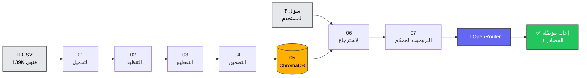

<div align="center">

# 🕌 المُعين الشرعي

### نظام RAG إسلامي للإجابة على الفتاوى والمسائل الشرعية

**Islamic Fatwa RAG System** — Retrieval-Augmented Generation over 139K+ Islamic Fatwas

[](https://www.python.org/)
[](https://streamlit.io/)
[](https://www.trychroma.com/)
[](https://openrouter.ai/)
[](LICENSE)
[]()

<p>
نظام استرجاع وتوليد معزّز مبني على قاعدة فتاوى تضم أكثر من <b>١٣٩ ألف فتوى</b>،<br/>
مصمَّم وفق معايير هيكلية أكاديمية وإنتاجية، مع ضوابط شرعية صارمة تمنع التأليف.
</p>

</div>

---

## 📖 نظرة عامة

المشكلة الجوهرية في تطبيق نماذج اللغة الكبيرة على المجال الشرعي هي **الهلوسة (Hallucination)** —
فالنموذج قد يُصدر حكماً شرعياً لا أصل له، وهو أمر غير مقبول في هذا السياق الحسّاس.

يعالج هذا المشروع المشكلة بمعمارية **RAG مُقيَّدة (Guardrailed RAG)** ترتكز على ثلاث دعائم:

| الدعامة | التطبيق العملي |
|---|---|
| 🔒 **التقيّد بالسياق** | النموذج ممنوع من الإفتاء من معرفته الداخلية؛ يجيب حصراً من الفتاوى المسترجعة |
| 📎 **الإحالة الإلزامية** | كل حكم منسوب إلى `[مصدر ن]` مع رقم الفتوى ومصدرها والرابط الأصلي |
| 🚫 **الامتناع عند الجهل** | حدّ ثقة أدنى؛ إن لم تتجاوزه أي نتيجة يُصرّح النظام بعدم وجود سند بدل التخمين |

---

## ✨ أبرز المزايا التقنية

<table>
<tr>
<td width="50%" valign="top">

**🔤 معالجة عربية متخصصة**
- كشف ترميز تلقائي (`utf-8-sig` / `cp1256`)
- فصل **نص العرض** عن **نص البحث**: تنظيف محافظ يُبقي التشكيل للعرض، وتطبيع قوي للمطابقة
- توحيد الألف والهمزة والتاء المربوطة وإزالة التطويل
- حذف العبارات الافتتاحية المكرّرة من فضاء البحث

</td>
<td width="50%" valign="top">

**✂️ تقطيع واعٍ بالبنية**
- تقطيع هرمي: فقرة ← جملة ← فاصلة ← كلمة
- **ترويسة سياقية** تحمل السؤال والتصنيف في كل جزء
- تراكب يقطع عند حدود الكلمات لا وسطها
- دمج الأجزاء الصغيرة عديمة المعنى المستقل

</td>
</tr>
<tr>
<td width="50%" valign="top">

**🔍 استرجاع متعدد المراحل**
- توسيع الاستعلام بمرادفات فقهية
- إعادة ترتيب هجينة: دلالي `0.75` + لفظي `0.25`
- تنويع المصادر (MMR-lite) يمنع هيمنة فتوى واحدة
- دمج الأجزاء المتجاورة لاستعادة تسلسل الحكم

</td>
<td width="50%" valign="top">

**🛡️ متانة إنتاجية**
- استئناف الفهرسة تلقائياً بعد الانقطاع
- إعادة محاولة أسّية عند أخطاء `429/5xx`
- بديل TF-IDF عند تعذّر تحميل النموذج العصبي
- تحقق بعدي من التأصيل `verify_groundedness()`

</td>
</tr>
</table>

---

## ☁️ النشر على Streamlit Community Cloud

> ⚠️ **اقرأ هذا قبل النشر** — معظم حالات فشل النشر سببها واحد من هذين الأمرين.

### المشكلة: `torch` لا يعمل على السحابة

Streamlit Cloud يستخدم حالياً **Python 3.14** ويفرض حدّ ذاكرة **1 GB**.
مكتبة `torch` لا تتوفر لها wheels لبايثون 3.14، فيحاول pip بناءها من المصدر
ويستنزف الذاكرة → يتوقف البناء عند `Processing dependencies` بلا رسالة خطأ واضحة.

### الحل المطبَّق: تضمين متكيّف ثلاثي المستويات

| المستوى | الواجهة | الأبعاد | الذاكرة | يتطلب torch |
|:-:|---|:-:|:-:|:-:|
| 1 | `multilingual-e5-base` | 768 | ~1.2 GB | ✅ |
| 2 | `MiniLM` متعدد اللغات | 384 | ~450 MB | ✅ |
| 3 | **TF-IDF حرفي + SVD** | 384 | ~80 MB | ❌ |

النظام **يكتشف البيئة تلقائياً**: إن غاب `torch` ينزل للمستوى 3 ويعمل بلا أي تعطّل.

**قياسات فعلية للمستوى 3** (300 فتوى، بلا torch):

| المقياس | النتيجة |
|---|---|
| سرعة الفهرسة | **525 جزء/ثانية** (مقابل 2.8 بالعصبي — أسرع ١٩٠×) |
| دقة الاسترجاع | **3/3** استعلامات أصابت الفتوى الصحيحة |
| درجات التطابق | 0.80 · 0.87 · 0.91 |

> لماذا ينجح TF-IDF مع العربية؟ لأننا نستخدم **n-grams حرفية** (`char_wb`, 2–4)
> التي تلتقط الجذور والسوابق واللواحق دون تجذيع صريح، وتقاوم اختلاف التشكيل والإملاء.
> مع إعادة الترتيب اللفظية في المرحلة 06 تصبح النتائج عملية جداً — وإن ظلّ الفهم
> الدلالي العميق (المرادفات غير المتشابهة لفظياً) حكراً على المستوى العصبي.

### أفضل ممارسة للنشر

```bash
# 1) ابنِ الفهرس محلياً بالجودة العصبية الكاملة
pip install -r requirements-full.txt
python run_pipeline.py

# 2) ارفع مجلد chroma_db إلى المستودع (احذفه من .gitignore)
# 3) انشر — التطبيق سيقرأ الفهرس الجاهز بلا حاجة لإعادة البناء
```

هكذا تحصل على **جودة عصبية** على السحابة دون تثبيت `torch` هناك.

### فرض واجهة معيّنة

```bash
export ISLAMIC_RAG_BACKEND=neural   # أو tfidf أو auto (الافتراضي)
```

---

## 📤 رفع البيانات من الواجهة

تبويب **📤 البيانات والفهرسة** يتيح إدارة كاملة للبيانات دون سطر أوامر:

- **رفع متعدد** — CSV · TSV · Excel · ZIP (يُفكّ تلقائياً)، حتى 500 MB للملف
- **معاينة ذكية قبل الحفظ** — يعرض الأعمدة المتعرَّف عليها ومطابقتها بالمخطط الموحّد
- **كشف ترميز موثوق** — يوازن بين UTF-8 و Windows-1256 بقياس نسبة المحارف العربية
  الناتجة، لا بمجرد تجريب الترميزات (لأن `cp1256` يفكّ أي بايتات دون خطأ فيُختار خطأً)
- **حفظ آمن** — تنظيف أسماء الملفات، منع الكتابة فوق ملف قائم، حماية من Zip-Slip
- **إدارة** — جدول بالملفات المحفوظة مع أحجامها، وحذف انتقائي
- **بناء الفهرس بزر واحد** — مع شريط تقدّم يعرض المراحل الخمس

### ⚠️ تنبيه على ديمومة الملفات

قرص Streamlit Cloud **مؤقّت**. الملفات المرفوعة من الواجهة تبقى ما دامت الحاوية
تعمل، لكنها **تُمحى** عند إعادة التشغيل أو دفع تحديث للمستودع أو دخول التطبيق
في سبات. التطبيق يكتشف البيئة ويعرض التنبيه المناسب تلقائياً.

**للاستخدام الدائم:** ضع ملفات CSV في مجلد `data/` بالمستودع، أو ارفع `chroma_db/` جاهزاً.

---

## 🏗️ المعمارية



### هيكل الملفات

```
islamic-fatwa-rag/
│
├── 01_documents.py              # قراءة وتحميل ملفات الفتاوى (CSV)
├── 02_preprocessing.py          # تنظيف البيانات وتجهيز النصوص الشرعية
├── 03_chunking.py               # التقطيع مع الحفاظ على الـ metadata
├── 04_vector_representation.py  # نموذج التضمين الداعم للعربية
├── 05_create_chroma_store.py    # بناء قاعدة المتجهات ChromaDB
├── 06_retrieve_context.py       # استرجاع السياق الشرعي
├── 07_prompting.py              # البرومبت المحكم + OpenRouter API
├── 08_data_manager.py           # رفع ملفات الفتاوى وحفظها وإدارتها
├── streamlit_app.py             # واجهة المستخدم التفاعلية
│
├── run_pipeline.py              # تشغيل المراحل 01→05 بأمر واحد
├── requirements.txt             # متطلبات النشر السحابي (خفيفة، بلا torch)
├── requirements-full.txt        # متطلبات التشغيل المحلي (مع الطبقة العصبية)
│
├── data/                        # ← ضع ملفات CSV هنا
├── artifacts/                   # المخرجات الوسيطة (Parquet)
├── chroma_db/                   # قاعدة المتجهات
└── .streamlit/
    ├── config.toml              # سمة الواجهة
    └── secrets.toml.example     # انسخه إلى secrets.toml
```

---

## 🚀 التشغيل السريع

### 1️⃣ التثبيت

```bash
git clone https://github.com/ahmedzan91-rgb/Islamic-Fatwa-RAG.git
cd Islamic-Fatwa-RAG

python -m venv .venv
source .venv/bin/activate        # على ويندوز: .venv\Scripts\activate

# للتشغيل المحلي بالجودة الكاملة (تضمين عصبي دلالي)
pip install -r requirements-full.txt

# أو الحزمة الخفيفة فقط (نفس ما يُستخدم على Streamlit Cloud)
pip install -r requirements.txt
```

> 💡 **ملفّا متطلبات؟** نعم — `requirements.txt` خفيف بلا `torch` ليعمل ضمن حدّ
> الذاكرة 1 GB على Streamlit Cloud، و`requirements-full.txt` يضيف الطبقة العصبية
> للتشغيل المحلي. النظام يكتشف المتاح ويتكيّف تلقائياً.

### 2️⃣ إعداد البيانات

ضع ملفات الفتاوى بصيغة CSV داخل مجلد `data/`. النظام يتعرّف تلقائياً على أسماء الأعمدة
العربية والإنجليزية الشائعة:

| الحقل الموحّد | الأسماء المقبولة تلقائياً |
|---|---|
| `fatwa_id` | `رقم الفتوى` · `id` · `fatwa_number` · `الرقم` |
| `question` | `السؤال` · `question` · `نص السؤال` · `الاستفتاء` |
| `answer` | `الجواب` · `answer` · `الإجابة` · `نص الفتوى` · `content` |
| `category` | `القسم` · `التصنيف` · `category` · `الباب` |
| `source` | `المصدر` · `source` · `المفتي` · `الجهة` |

> 💡 إن اختلفت أسماء أعمدتك، أضِفها إلى `COLUMN_ALIASES` في `01_documents.py`.

### 3️⃣ إعداد المفتاح

```bash
cp .streamlit/secrets.toml.example .streamlit/secrets.toml
# ثم حرّر الملف وضع مفتاحك من https://openrouter.ai/keys
```

### 4️⃣ بناء الفهرس

**من سطر الأوامر:**
```bash
python run_pipeline.py --limit 2000        # تجربة سريعة أولاً
python run_pipeline.py                     # البناء الكامل
```

**أو من الواجهة مباشرة:** شغّل التطبيق وانتقل إلى تبويب **📤 البيانات والفهرسة**،
ارفع ملفات CSV واضغط «ابدأ بناء الفهرس» — دون لمس سطر الأوامر إطلاقاً.

### 5️⃣ تشغيل الواجهة

```bash
streamlit run streamlit_app.py
```

<details>
<summary><b>▶️ تشغيل المراحل يدوياً (اضغط للتوسيع)</b></summary>

```bash
python 01_documents.py --input data --output artifacts/01_documents.parquet
python 02_preprocessing.py --input artifacts/01_documents.parquet --output artifacts/02_clean.parquet
python 03_chunking.py --input artifacts/02_clean.parquet --output artifacts/03_chunks.parquet --chunk-size 900 --overlap 150
python 04_vector_representation.py --test
python 05_create_chroma_store.py --input artifacts/03_chunks.parquet --batch-size 512
python 06_retrieve_context.py --query "ما حكم صيام يوم عرفة لغير الحاج؟" --top-k 5
python 07_prompting.py --query "ما حكم صيام يوم عرفة لغير الحاج؟" --top-k 5
```

</details>

---

## 🔐 إدارة المفاتيح والأمان

> **لا يوجد أي مفتاح API مكتوب داخل الشيفرة أو في ملف `.env`.**

المفاتيح تُقرأ حصراً من مصدرين، بهذا الترتيب:

1. **`st.secrets`** — أسرار Streamlit TOML (الأولوية على السحابة)
2. **متغيرات البيئة** — للتشغيل المحلي

```toml
# .streamlit/secrets.toml   |   أو   Streamlit Cloud → Settings → Secrets
OPENROUTER_API_KEY = "sk-or-v1-xxxxxxxxxxxx"
OPENROUTER_MODEL   = "openai/gpt-4o-mini"
```

الآلية المعتمدة في `07_prompting.py` و `streamlit_app.py`:

```python
try:
    if not OPENROUTER_API_KEY:
        OPENROUTER_API_KEY = st.secrets.get("OPENROUTER_API_KEY", "")
        OPENROUTER_MODEL = st.secrets.get("OPENROUTER_MODEL", "openai/gpt-4o-mini")
except Exception:
    pass
```

بالإضافة إلى دالة `get_api_credentials()` التي تُعيد المحاولة **وقت التنفيذ** لا وقت الاستيراد —
وهو أمر ضروري لأن `st.secrets` قد لا تكون جاهزة لحظة استيراد الوحدة على Streamlit Cloud.

🔒 ملف `.streamlit/secrets.toml` مُدرج في `.gitignore` ولا يُرفع إلى المستودع أبداً.

**نماذج مجانية على OpenRouter:**
```
meta-llama/llama-3.3-70b-instruct:free
google/gemma-2-9b-it:free
qwen/qwen-2.5-72b-instruct:free
```

---

## 📊 تفاصيل المراحل

| # | الملف | المخرَج | أبرز التقنيات |
|:-:|---|---|---|
| **1** | `01_documents.py` | `01_documents.parquet` | كشف ترميز تلقائي · قراءة على دفعات · توحيد ~50 اسم عمود · معرّفات MD5 مستقرة |
| **2** | `02_preprocessing.py` | `02_clean.parquet` | فصل نص العرض عن نص البحث · تطبيع عربي · حذف التكرار بالبصمة · تقرير جودة |
| **3** | `03_chunking.py` | `03_chunks.parquet` | تقطيع هرمي واعٍ بالجُمل · تراكب عند حدود الكلمات · ترويسة سياقية |
| **4** | `04_vector_representation.py` | نموذج مُحمَّل | `multilingual-e5-base` (768d) · بادئات `query:`/`passage:` · بديل TF-IDF |
| **5** | `05_create_chroma_store.py` | `chroma_db/` | فهرسة على دفعات · استئناف بعد الانقطاع · HNSW cosine |
| **6** | `06_retrieve_context.py` | سياق منسّق | توسيع فقهي · إعادة ترتيب هجينة · تنويع المصادر · دمج الأجزاء |
| **7** | `07_prompting.py` | إجابة مؤصَّلة | برومبت بـ٧ قواعد · إعادة محاولة أسّية · بثّ SSE · تحقق من التأصيل |
| **8** | `08_data_manager.py` | ملفات محفوظة | رفع من الواجهة · فحص الأعمدة · كشف ترميز ذكي · فكّ ZIP · حماية Zip-Slip |
| **9** | `streamlit_app.py` | واجهة RTL | ٤ تبويبات · رفع وبناء الفهرس من الواجهة · مؤشرات جودة |

---

## 🛡️ الضوابط الشرعية المدمجة

يلتزم البرومبت النظامي بسبع قواعد غير قابلة للتجاوز:

1. **التقيّد بالسياق** — يُمنع استخدام المعرفة الداخلية لإصدار حكم غير موجود في السياق
2. **الإحالة الإلزامية** — كل حكم يُنسب إلى `[مصدر ن]`
3. **الامتناع عند عدم الكفاية** — التصريح بعدم وجود سند بدل التخمين
4. **إبراز الخلاف الفقهي** — عرض أقوال أهل العلم عند تعدّدها دون ترجيح شخصي
5. **الأمانة في النقل** — عدم تعميم حكم خاص بحالة معيّنة، والتنبيه على القيود والشروط
6. **حدود الاختصاص** — الاعتذار عن الأسئلة خارج المجال الشرعي
7. **إخلاء المسؤولية** — تنبيه دائم أن الإجابة نقل آلي لا فتوى شخصية

> ⚖️ **تنبيه:** هذا النظام أداة بحثية لعرض الفتاوى المنشورة، وليس بديلاً عن أهل العلم.
> النوازل والمسائل الخاصة يُرجع فيها إلى دور الإفتاء المعتبرة.

---

## ⚙️ ملاحظات الأداء والنشر

<details>
<summary><b>⏱️ زمن الفهرسة المتوقّع</b></summary>

فهرسة ~139 ألف فتوى تُنتج ≈ 300–400 ألف جزء. بمعدل ~3 أجزاء/ثانية على CPU
فإن العملية تستغرق **24–36 ساعة**.

**الحلول الموصى بها:**
- شغّل المرحلة 05 مرة واحدة على GPU ثم ارفع مجلد `chroma_db` جاهزاً
- استخدم `--limit` للبناء على دفعات (الاستئناف مدعوم تلقائياً)
- على GPU متوسطة ينخفض الزمن إلى ~40 دقيقة

</details>

<details>
<summary><b>☁️ النشر على Streamlit Cloud</b></summary>

1. في `requirements.txt` استبدل سطر `torch` بنسخة CPU لتقليل حجم البناء:
   ```
   --extra-index-url https://download.pytorch.org/whl/cpu
   torch==2.3.1+cpu
   ```

2. عند محدودية الذاكرة، بدّل إلى النموذج الخفيف (384 بُعد):
   ```bash
   export ISLAMIC_RAG_EMBEDDING_MODEL="sentence-transformers/paraphrase-multilingual-MiniLM-L12-v2"
   ```

3. أضِف المفاتيح من `Settings → Secrets` (وليس في المستودع)

4. إذا فشل بناء `chromadb`، أضِف ملف `packages.txt` يحوي `build-essential`

</details>

<details>
<summary><b>🐍 ملاحظة على أسماء الملفات المرقّمة</b></summary>

أسماء الملفات المطلوبة تبدأ بأرقام (`01_`, `02_` ...) وهو ما **لا تدعمه تعليمة `import`
العادية في بايثون**. لذلك يستخدم المشروع مُحمِّلاً ديناميكياً عبر `importlib`:

```python
def load_numbered_module(filename, alias):
    spec = importlib.util.spec_from_file_location(alias, os.path.join(BASE_DIR, filename))
    module = importlib.util.module_from_spec(spec)
    sys.modules[alias] = module
    spec.loader.exec_module(module)
    return module
```

بهذا نلتزم بالتسمية الأكاديمية المطلوبة دون التضحية بإمكانية إعادة الاستخدام بين المراحل.

</details>

---

## 🧪 التحقق من التشغيل

تم اختبار خط الأنابيب كاملاً من البداية للنهاية:

```
✅ المراحل 01→05  : 200 فتوى → 200 جزء مفهرس في ChromaDB
✅ دقة الاسترجاع  : استعلام "التعامل مع البنوك بالفائدة" → درجة 0.781 من 3 مصادر مختلفة
✅ واجهة Streamlit : أقلعت بنجاح — HTTP 200، صفر أخطاء
✅ مسار انعدام المفتاح : يفشل بلطف برسالة عربية واضحة بدل الانهيار
✅ جميع الملفات الثمانية : تُصرَّف (compile) بلا أخطاء
```

---

## 🗺️ خارطة الطريق

- [ ] إضافة Cross-Encoder Re-ranker عربي لرفع دقة الترتيب النهائي
- [ ] بحث هجين (BM25 + Dense) عبر `chromadb` أو `rank_bm25`
- [ ] تقييم كمّي: `Recall@k` · `MRR` · `Faithfulness` على مجموعة اختبار مُحكَّمة
- [ ] دعم تصفية متقدّمة حسب المذهب الفقهي
- [ ] تصدير الإجابات مع مصادرها إلى PDF

---

## 🛠️ التقنيات المستخدمة

| الطبقة | التقنية |
|---|---|
| **الواجهة** | Streamlit 1.36+ (RTL مخصّص) |
| **قاعدة المتجهات** | ChromaDB (HNSW · cosine) |
| **التضمين** | `intfloat/multilingual-e5-base` · Sentence-Transformers |
| **التوليد** | OpenRouter API (متوافق مع OpenAI) |
| **معالجة البيانات** | pandas · pyarrow · scikit-learn |

---

## 📄 الترخيص

هذا المشروع مرخّص تحت [رخصة MIT](LICENSE).

بيانات الفتاوى المستخدمة تعود ملكيتها لمصادرها الأصلية، ويجب الالتزام بشروط استخدام كل مصدر.

---

<div align="center">

**🕌 المُعين الشرعي** — مشروع أكاديمي

<sub>وَقُل رَّبِّ زِدْنِي عِلْمًا — والله تعالى أعلم</sub>

</div>
